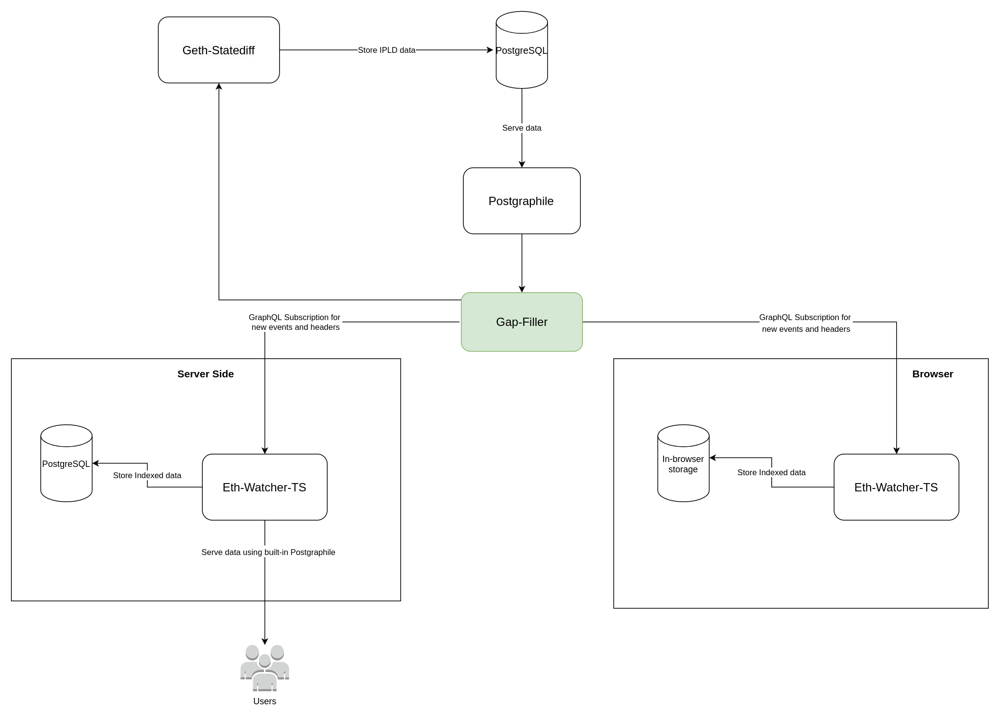

# gap-filler

gap-filler service runs graphql proxy, handle predefined list of queries from [eth-watcher-ts](https://github.com/vulcanize/eth-watcher-ts) and if response from indexer's postgraphile is empty, 
them call [geth-statediff](https://github.com/vulcanize/go-ethereum/releases) to generate state diff.

## Application Diagram

## Usage
After building the binary, run as

`./gap-filler proxy`

## Environment Variables

| Name        | Default Value      | Comment                     |
|-------------|--------------------|-----------------------------|
| GQL_TARGET   | http://127.0.0.1:5020/graphql            | URL of source Postgraphile          |
| GQL_GUI   | false            | Enable graphiql interface          |
| ETH_RPC        | http://127.0.0.1:8545               | Ethereum rpc address           |
| HTTP_HOST      | 127.0.0.1         | Gap-filler host |
| HTTP-PORT     | 8080               | Gap-filler port            |
| HTTP-PATH     | /               | Gap-filler base path. Result URL is `http://$HTTP_HOST:$HTTP-PORT$HTTP-PATH/graphql`            |
